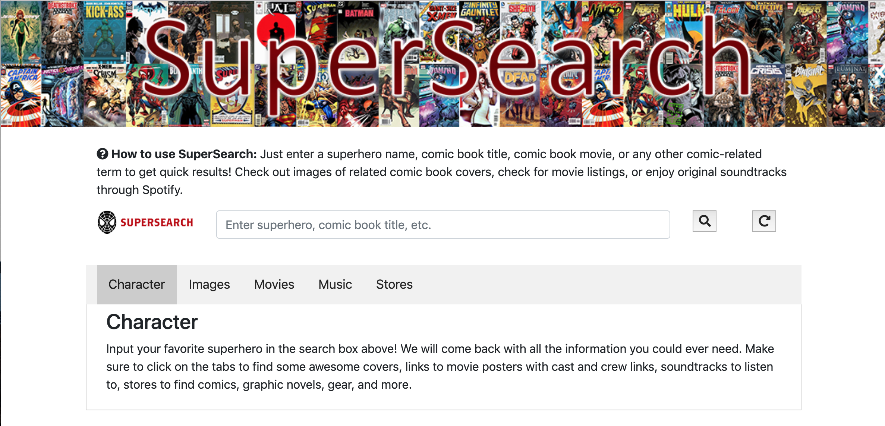

# SuperSearch

### Team Members
- Sarah Beecroft
- Dongdong Zhang
- Jon Lindley

### Role
Lead Front-end Developer

### Tools and APIs Utilized
- HTML
- CSS
- JavaScript
- Comicvine API
- iTunes API
- SuperHero API
- Yelp API
- Google Maps API
- iTunes API
- Firebase
- Adobe Photoshop

### App Description
SuperSource is your all-in-one comic book content resource! Just enter in a search term (your favorite superhero, comic book, etc.),
and hit enter or press submit to get quick character, image, movie, music, and store results. 

### How to Use?
Simply type in the names of superheroes (ex. Hulk) and hit enter, and the search results boxes would show the hero-relevant character, image, movie, music, and store results. 

### Link to SuperSource
https://sarahmbeecroft.github.io/Project-1/

### Contact Information
General Inquiries at ddzhang2018@gmail.com
